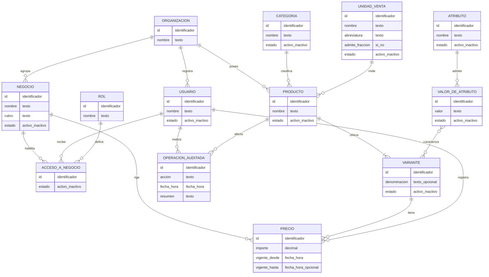

# Modelo conceptual

Este modelo describe conceptos del negocio y sus relaciones. No decide todavía tablas, endpoints ni tecnologías.

## Conceptos

### Organización

Titular de uno o más negocios. Es el ámbito al que pertenecen el catálogo, los usuarios y las definiciones compartidas como categorías, unidades y atributos.

El MVP funcionará con una única organización y un único negocio, creados durante la instalación. El concepto se modela desde el principio porque el historial de precios es inmutable y no podría atribuirse a un negocio de forma retroactiva.

### Negocio

Comercio concreto donde se venden los productos: la mercería, una despensa o una segunda sucursal del mismo rubro. Es el ámbito al que pertenecen el precio vigente y, en el futuro, la existencia física, las ventas y las compras.

Un producto se considera disponible en un negocio cuando tiene un precio vigente en ese negocio. Esto permite que dos rubros muy distintos convivan en una misma organización sin que sus catálogos se mezclen en las consultas.

### Categoría

Agrupa productos para navegar y organizar el catálogo. Ejemplos iniciales: telas, útiles, lanas, agujas y cintas. La lista definitiva se obtendrá de las carpetas reales y dependerá del rubro de cada negocio.

### Unidad de venta

Indica cómo se expresa el precio: unidad, metro, kilo, paquete, rollo u otra medida. Distingue además si admite cantidades fraccionarias, porque un producto vendido por metro o por kilo podrá registrarse en el futuro con cantidades decimales.

### Producto

Agrupación comercial que sirve para buscar y navegar. Reúne las presentaciones o versiones que la usuaria considera «lo mismo»: una cinta bebé N.º 2 con sus colores, o una gaseosa con sus tamaños.

El producto no lleva precio por sí mismo: lo llevan sus variantes.

### Variante

**Unidad vendible.** Es lo que efectivamente se vende, se cotiza y, en el futuro, se cuenta y se escanea: la cinta bebé N.º 2 roja, la gaseosa de 1,5 litros, el cuaderno tapa dura de 48 hojas.

Todo producto tiene al menos una variante. Cuando un producto no presenta diferencias reales, su única variante es implícita: la usuaria crea y edita el producto sin percibir este nivel, y la aplicación no le pide datos adicionales.

La variante es el concepto que sostiene los tres objetivos futuros del sistema, porque todos describen la misma cosa física:

- el precio, que puede diferir entre presentaciones de un mismo producto;
- la existencia en inventario, que se cuenta por unidad concreta;
- el código de barras, que identifica una presentación y no una agrupación.

Cuando varias variantes comparten precio, como suele ocurrir con los colores de una misma cinta, la aplicación permitirá fijarlo para todas ellas en una sola operación. Compartir el precio es una comodidad de la interfaz, no una restricción del modelo.

### Atributo y valor de atributo

Característica normalizada con la que se distingue una variante, junto con la lista cerrada de valores que admite. El sistema comienza con el atributo `color` y sus valores precargados; una usuaria autorizada puede agregar valores y, más adelante, atributos aplicables a otros rubros, como marca, sabor o presentación.

Los valores no se escriben libremente en cada variante. Eso evita diferencias como `Rojo`, `rojo` y `ROJO`, y hace que incorporar un rubro nuevo sea una carga de datos y no una modificación del sistema.

Las características que no necesiten integridad ni filtros frecuentes podrán seguir describiéndose como texto dentro del producto.

### Precio

Registro temporal del precio final al público de una variante en un negocio. El importe es siempre positivo y se expresa exclusivamente en ARS. El registro sin fecha de finalización es el vigente. Los precios anteriores no se borran ni modifican durante la operación normal.

Una misma variante puede tener precios distintos en dos negocios de la misma organización.

### Usuario, rol y acceso

Identifican a toda persona que accede al sistema y determinan sus permisos. Los roles iniciales son Administrador, Gerente y Empleado; no existe consulta pública del catálogo.

El acceso se otorga sobre un negocio: una persona puede trabajar en un negocio, en varios o en todos los de la organización. Quien accede a más de uno podrá ver la información consolidada. En el MVP, con un único negocio, todas las cuentas acceden a él.

### Operación auditada

Registro de una acción relevante, como crear, editar, desactivar o importar. Complementa el historial específico de precios.

## Extensiones futuras previstas

- Código de identificación de la variante, incluido el código de barras.
- Proveedor y relación entre proveedor y producto o variante.
- Faltante y cantidad solicitada.
- Lista de compra agrupada por proveedor o categoría.
- Estado de reposición y sus transiciones.
- Existencia por variante y negocio.
- Movimiento de inventario.
- Venta, detalle de venta y cobro.
- Compra, detalle de compra y pago.
- Costo de adquisición y margen, con visibilidad restringida.

Todas estas extensiones se apoyan en la variante y en el negocio, que por eso se modelan desde el comienzo aunque el MVP no los explote.
