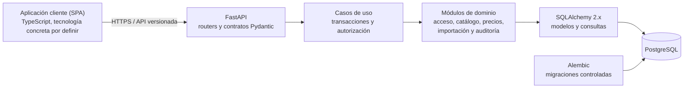

# Propuesta de arquitectura técnica

## Estado

**Aprobado.** El Responsable del proyecto aprobó el conjunto PT-001 a PT-012 el
27 de agosto de 2026. Esta aprobación autoriza el inicio de la programación del
MVP. Las propuestas marcadas todavía como pendientes en este documento
(PT-006, PT-007, PT-011) dependen de la muestra real o de elegir un servicio
concreto, y no bloquean comenzar: el resto del sistema puede construirse en
paralelo.

La separación entre Producto y Variante quedó resuelta en D-006: la variante es
la unidad vendible y lleva el precio. Lo que continúa pendiente de revisar
productos reales es **qué** variantes tiene cada producto de este negocio, la
forma concreta de sus atributos y la plantilla de importación.

## Criterios utilizados

La recomendación prioriza:

- integridad transaccional para el precio vigente, su historial y la auditoría;
- simplicidad operativa para pocos dispositivos y baja concurrencia;
- separación clara entre la API, las reglas del negocio y la persistencia;
- facilidad para probar y modificar un dominio todavía provisional;
- uso directo de las capacidades relacionales de PostgreSQL;
- posibilidad de evolucionar sin introducir servicios distribuidos antes de
  necesitarlos.

## SQLAlchemy frente a SQLModel

Tanto SQLAlchemy como SQLModel son compatibles con FastAPI y PostgreSQL.
SQLModel utiliza SQLAlchemy y Pydantic internamente; no constituye un motor de
persistencia ni un sistema de migraciones diferente.

| Criterio | SQLAlchemy 2.x directo | SQLModel |
|---|---|---|
| Propósito principal | ORM y toolkit SQL general | Capa que integra SQLAlchemy y Pydantic con menos repetición |
| Modelos de API | Se definen como esquemas Pydantic separados | Puede compartir bases entre modelos de tabla y de datos |
| Restricciones y funciones de PostgreSQL | Acceso directo y explícito | Posibles, pero las necesidades avanzadas terminan usando API de SQLAlchemy |
| Alembic | Integración directa con su `MetaData` | Funciona porque expone metadatos de SQLAlchemy |
| Curva inicial | Más conceptos y algo más de código | CRUD sencillo más breve |
| Separación de responsabilidades | Naturalmente explícita | Requiere disciplina para no acoplar tabla, entrada y respuesta |
| Adecuación a este dominio | Alta: precios temporales, restricciones, auditoría, importación y búsqueda | Buena para prototipos y CRUD; aporta menos ventaja cuando predominan reglas y transacciones |

La propia documentación de SQLModel muestra que, en una API real, los modelos
de tabla, creación, actualización y respuesta suelen ser distintos. La
reducción de duplicación existe, pero no elimina esa separación.

### Recomendación propuesta

Usar **SQLAlchemy 2.x directamente para la persistencia** y **Pydantic para los
contratos HTTP**.

Los modelos ORM no se devolverán directamente desde la API. Esta separación
permite:

- evitar que una modificación de tabla cambie accidentalmente el contrato HTTP;
- impedir que campos internos o sensibles aparezcan en respuestas;
- representar de forma distinta las entradas de creación, modificación y
  lectura;
- expresar sin capas adicionales las restricciones, índices y funciones
  específicas de PostgreSQL;
- revisar con claridad las migraciones generadas por Alembic.

SQLModel sería una alternativa razonable si la prioridad principal fuera
minimizar código en un CRUD pequeño. En este sistema, el ahorro es menos
importante que la visibilidad de las transacciones y del esquema.

## Acceso síncrono frente a asíncrono

| Criterio | Síncrono | Asíncrono |
|---|---|---|
| Modelo mental | Flujo secuencial y sesiones ORM tradicionales | Cada operación de E/S debe esperarse explícitamente |
| Driver PostgreSQL | Driver síncrono | Driver compatible con `asyncio` |
| FastAPI | Las funciones `def` con E/S bloqueante se ejecutan en su pool de hilos | Las funciones `async def` ceden el control al esperar E/S |
| Sesión ORM | Una sesión por solicitud | Una `AsyncSession` por solicitud y por tarea concurrente |
| Relaciones ORM | Carga explícita o diferida tradicional | Se debe evitar la E/S implícita y planificar las cargas |
| Beneficio típico | Simplicidad y muy buen desempeño con concurrencia baja o media | Mejor uso de un proceso ante mucha concurrencia que espera E/S |
| Costo en este MVP | Bajo | Mayor cantidad de estados, pruebas y errores posibles sin una necesidad medida |

El catálogo inicial tendrá cientos de productos, deberá escalar a algunos miles
y será utilizado desde pocos dispositivos. La carga dominante serán consultas
cortas a una única base de datos. No hay transmisiones en tiempo real ni varias
API externas que deban esperarse en paralelo.

### Recomendación propuesta

Usar inicialmente:

- SQLAlchemy síncrono;
- un driver PostgreSQL síncrono mantenido;
- una `Session` independiente por solicitud;
- operaciones de FastAPI declaradas con `def` cuando recorran el camino
  síncrono de persistencia;
- límites explícitos del pool de conexiones definidos en la configuración
  privada del despliegue.

FastAPI puede combinar funciones síncronas y asíncronas, por lo que esta
elección no obliga a convertir en síncrona toda integración futura. Se debería
revisar la decisión si una prueba de carga representativa muestra que la espera
de E/S y el pool de hilos son el cuello de botella, o si el producto incorpora
muchas integraciones concurrentes, conexiones prolongadas o tiempo real.

No se propone construir desde el inicio una abstracción duplicada para poder
cambiar de síncrono a asíncrono. Mantener las reglas del negocio fuera de los
routers y de los modelos ORM será suficiente para limitar el costo de una
eventual migración.

## Migraciones con Alembic

Alembic será la única vía para crear y modificar el esquema en entornos
compartidos. La aplicación no ejecutará `create_all()` al iniciar.

### Organización propuesta

- Una única historia lineal de revisiones durante el MVP.
- Una migración inicial capaz de construir una base vacía.
- Revisiones guardadas junto con el código y tratadas como inmutables después de
  haberse aplicado en un entorno compartido.
- Una convención de nombres de SQLAlchemy para claves primarias y foráneas,
  restricciones `UNIQUE` y `CHECK`, e índices.
- `target_metadata` conectado explícitamente con los modelos ORM.
- URL y credenciales obtenidas de la configuración privada, nunca incorporadas
  al repositorio.

### Flujo para cada cambio

1. Modificar el modelo propuesto.
2. Generar una revisión candidata con `--autogenerate`.
3. Leer y ajustar manualmente `upgrade()` y `downgrade()`.
4. Verificar SQL, restricciones, conversiones y posibles pérdidas de datos.
5. Probar el avance desde una base vacía y desde la revisión anterior usando
   PostgreSQL real.
6. Comprobar que el modelo y la última revisión no difieran mediante
   `alembic check`.
7. Aplicar la migración una sola vez como paso controlado del despliegue, antes
   de habilitar la nueva versión de la aplicación.

`--autogenerate` se utilizará como asistente, no como aprobación automática.
Los cambios de nombre pueden aparecer como eliminación y creación, y algunas
restricciones, funciones o transformaciones de datos requieren instrucciones
manuales.

Las migraciones de datos pequeñas y deterministas, como los dos roles iniciales
y la organización y el negocio únicos del MVP, podrán acompañar una revisión.
Los valores iniciales de atributos, las categorías y las unidades se
incorporarán recién después de validarlos, y deberán tratarse como datos
iniciales del rubro y no como parte fija del esquema. La importación comercial
de productos no será una migración de esquema.

Para producción se verificará una copia recuperable antes de una migración con
riesgo. No se prometerá un `downgrade` destructivo automático cuando no sea
posible reconstruir los datos eliminados.

## Interfaz: aplicación cliente separada frente a renderizado en el servidor

| Criterio | Renderizado en el servidor | Aplicación cliente separada (SPA) |
|---|---|---|
| Stacks a mantener | Uno solo (Python) | Dos (Python en la API, TypeScript en el cliente) |
| Interactividad táctil | Adecuada para formularios y listados simples | Más rica: transiciones, actualizaciones parciales, componentes reutilizables |
| Separación API/interfaz | La API queda acoplada a las plantillas de respuesta | La API se consume igual que cualquier cliente futuro |
| Complejidad operativa | Menor: un solo proceso a desplegar | Mayor: build del cliente, versionado propio, CORS o mismo dominio a coordinar |
| Adecuación a este proyecto | Menos piezas para que una IA mantenga sincronizadas | Coincide con un contrato HTTP ya pensado como frontera explícita (D-002, arquitectura de la API) |

### Decisión

El Responsable del proyecto optó por la **aplicación cliente separada con
TypeScript**, aceptando conscientemente el costo de mantener dos stacks a
cambio de una interfaz más rica y de una frontera API/interfaz más neta. La
tecnología concreta del cliente (React u otra equivalente) queda por definir al
iniciar la programación, sin que esa elección afecte al resto de este
documento: la API se diseñó desde el principio para no devolver modelos ORM
directamente ([SQLAlchemy frente a SQLModel](#sqlalchemy-frente-a-sqlmodel)),
lo que la vuelve consumible por cualquier cliente.

La sesión seguirá siendo opaca y del lado del servidor (PT-005), transportada
en una cookie protegida. Si la SPA se sirve desde un origen distinto al de la
API, la configuración de la cookie (`SameSite`, dominio) y la política CORS
deberán coordinarse explícitamente; sigue siendo preferible a un token
reutilizable manejado por el código del cliente.

## Arquitectura propuesta

Se recomienda un **monolito modular**: una aplicación desplegable y una base de
datos PostgreSQL. No se justifican microservicios, colas distribuidas, caché
externa ni una base separada para búsquedas en el MVP.

### Módulos funcionales

1. **Acceso**
   - autenticación, cierre de sesión y cuenta activa;
   - roles Administradora y Empleada;
   - alta, modificación y desactivación de cuentas;
   - recuperación de acceso según la política pendiente.

2. **Catálogo**
   - productos, variantes, categorías, unidades, atributos y sus valores;
   - estados activo e inactivo;
   - detección de posibles duplicados;
   - búsqueda y navegación.

3. **Precios**
   - consulta del precio vigente de una variante en el negocio activo;
   - cambio transaccional de precio, individual o para todas las variantes de un
     producto;
   - historial cronológico inmutable desde las funciones normales.

4. **Importaciones**
   - recepción y análisis de CSV o Excel;
   - vista previa sin alterar el catálogo;
   - confirmación por Administradora;
   - errores por fila y resumen auditable.

5. **Auditoría**
   - actor, momento, acción, entidad afectada y resumen mínimo;
   - exclusión explícita de contraseñas, sesiones, secretos y cuerpos completos
     que pudieran contener información sensible.

Los módulos se comunicarán dentro del mismo proceso mediante casos de uso
explícitos. No se propone una capa de repositorio genérica que oculte todas las
capacidades de SQLAlchemy; cada módulo tendrá consultas orientadas a sus
necesidades.

### Límite de una solicitud

El router:

1. valida el contrato HTTP;
2. obtiene la sesión y el Usuario activo mediante dependencias;
3. delega en un caso de uso;
4. transforma el resultado a un esquema de respuesta.

El caso de uso abre el límite transaccional, verifica permisos y coordina las
operaciones. Solo confirma la transacción si todas concluyen correctamente. Los
routers no contendrán reglas de vigencia de precios ni escribirán directamente
varias tablas.

## Persistencia propuesta, todavía provisional

El núcleo relacional candidato incluye:

- organizaciones y negocios;
- roles, usuarios, accesos por negocio y sesiones;
- categorías, unidades de venta, atributos y sus valores;
- productos y variantes;
- precios con períodos de vigencia, referidos a una variante y a un negocio;
- operaciones auditadas;
- ejecuciones y resultados de importación.

Los nombres exactos, claves y cardinalidades se definirán en el diseño físico.
Esta lista no debe interpretarse todavía como un esquema aprobado.

### Reglas que deberán existir también en PostgreSQL

- importe estrictamente mayor que cero;
- un solo precio sin fecha de finalización por cada par de variante y negocio;
- al menos una variante por producto;
- referencias válidas a categoría, unidad, valor de atributo, negocio y Usuario;
- unicidad normalizada donde corresponda, por ejemplo para los valores de un
  mismo atributo;
- fechas de vigencia coherentes;
- conservación de referencias históricas aunque una entidad se desactive.

La unicidad del precio vigente se reforzará con un índice único parcial sobre
variante y negocio, restringido a las filas sin fecha de finalización, y no solo
con una validación de la API.

La regla «al menos una variante por producto» no puede expresarse con una
restricción declarativa simple, porque involucra dos tablas. Se propone
garantizarla creando el producto y su primera variante dentro de la misma
transacción, e impidiendo eliminar la última variante de un producto. Si más
adelante se necesitara una garantía más fuerte, podrá evaluarse una restricción
diferida o un disparador.

### Alcance por negocio

Toda tabla cuya información dependa del comercio llevará la referencia al
negocio desde su primera migración, aunque el MVP opere con uno solo. Agregar
esa referencia después obligaría a atribuir retroactivamente filas de historial
que el sistema trata como inmutables.

Las consultas se filtrarán siempre por los negocios habilitados para la cuenta
activa. Mientras exista un único titular no se propone aislamiento a nivel de
base de datos; si en el futuro la organización alojara negocios de titulares
distintos, deberá revisarse esa decisión antes de dar acceso a un tercero
(DP-007).

Las fechas se almacenarán con zona horaria y se normalizarán para persistencia.
La interfaz podrá presentarlas en la zona horaria del despliegue. Los importes
se almacenarán como decimales exactos, nunca como punto flotante.

### Producto, Variante, atributos y JSONB

Queda decidido:

- Variante es una entidad real y obligatoria, dueña del precio y futura
  portadora del código de identificación y de la existencia física;
- Producto es la agrupación que sirve para buscar y navegar, y no lleva precio;
- los atributos normalizados y sus valores son tablas relacionales, con el color
  como primer caso y sin tratamiento especial en el código.

Sigue siendo provisional:

- `JSONB` podrá contener únicamente características realmente libres que no
  requieran integridad ni filtros frecuentes;
- los atributos conocidos que necesiten integridad, relaciones o filtros
  frecuentes deberán promoverse a atributos normalizados;
- no se creará un sistema genérico de definiciones de atributos por rubro más
  allá del par atributo/valor descrito, ni un modelo EAV completo.

La distinción entre un atributo normalizado y un dato en `JSONB` es una decisión
por caso, no una regla general: la primera da integridad y filtros; la segunda,
libertad. La muestra real dirá cuáles características de este negocio merecen
cada tratamiento.

Los atributos `JSONB` tendrán validación en la aplicación. La base relacional
continuará siendo la fuente de verdad para identidad, estado, precio y
relaciones.

## Operaciones críticas

### Cambio de precio

Una única transacción deberá:

1. verificar la variante, el negocio y el precio que la usuaria vio;
2. detectar si otra operación lo cambió;
3. cerrar la vigencia anterior;
4. insertar el nuevo precio;
5. registrar a la responsable y la auditoría;
6. confirmar todos los cambios juntos.

Si el precio cambió desde que se mostró el formulario, la API responderá con un
conflicto y el valor actual para solicitar una nueva confirmación. Después de
esa confirmación, prevalecerá el último cambio aceptado, de acuerdo con la regla
vigente.

### Cambio de precio de todas las variantes de un producto

Es la operación habitual en la mercería, donde los colores de una misma cinta
comparten precio. Deberá resolverse en **una sola transacción** que repita los
pasos anteriores para cada variante activa del producto en el negocio activo.

Su propiedad relevante es la atomicidad: si una de las variantes falla, no debe
aplicarse ninguna. Un producto que quedara con la mitad de sus colores al precio
nuevo y la otra mitad al viejo produciría exactamente el error que el sistema
viene a eliminar.

La detección de conflictos considerará el conjunto: si cualquiera de las
variantes cambió desde que se mostró el formulario, la operación se rechazará
mostrando el estado actual de todas.

### Alta de producto

Producto, primera variante, precio inicial y auditoría se crearán en la misma
transacción. Una variante sin precio vigente en un negocio no será visible como
publicable en ese negocio.

### Importación

El análisis generará una vista previa identificable y no modificará el catálogo.
La confirmación comprobará que la vista previa sigue siendo aplicable antes de
escribir. Queda pendiente decidir si una importación con errores debe ser
atómica o puede aplicar solo filas válidas.

## Búsqueda

El contrato funcional requiere:

- ignorar mayúsculas, minúsculas y acentos;
- aceptar términos en cualquier orden;
- buscar nombre, categoría y atributos relevantes;
- excluir entidades inactivas de la consulta normal;
- excluir las variantes sin precio vigente en el negocio activo;
- mostrar la variante coincidente cuando ayude a distinguir resultados.

La unidad indexable será la variante, porque es la que combina el nombre del
producto con sus atributos y la que lleva el precio a mostrar. Queda pendiente
decidir si el resultado se presenta como una fila por variante o como una fila
por producto que se despliega (DP-006).

Se propone comenzar con normalización consistente y semántica `AND` entre los
términos. PostgreSQL resolverá la búsqueda sobre un texto derivado de los datos
relacionales y de los atributos aprobados. La forma exacta —consulta directa,
documento de búsqueda derivado o índices como trigramas— se elegirá después de
probar la muestra real. No se incorporará un buscador externo para varios miles
de registros sin evidencia de que PostgreSQL incumple el objetivo de dos
segundos.

## Sesión y protección de acceso

Para la aplicación web se propone una sesión opaca mantenida por el servidor y
transportada en una cookie protegida. Esto permite revocar sesiones al
desactivar una cuenta y evita exponer credenciales reutilizables al código de la
interfaz.

La autorización se comprobará en la API para cada función; ocultar un control en
la interfaz no será una medida de autorización. Las acciones que modifican datos
incluirán protección contra solicitudes forjadas. La duración, límites,
material criptográfico y demás parámetros operativos permanecerán en
configuración privada y fuera de esta documentación.

No se registrarán dispositivos ni información personal. Los registros de acceso
y auditoría usarán el identificador interno y el nombre de usuario estrictamente
necesario para atribuir operaciones.

## Despliegue

El sistema es de uso privado: no se publicará su código ni su documentación, y
no está pensado como un producto para terceros. Esto es independiente de cómo
se aloje la aplicación en funcionamiento.

Para que el dueño o cualquier Usuario autorizado pueda consultar el sistema
desde su celular estando fuera del negocio, la aplicación deberá ser
alcanzable por internet y no solo dentro de la red del local. Esto no debilita
la privacidad si se cumplen las condiciones ya exigidas en este documento y en
los requisitos no funcionales:

- HTTPS en toda comunicación, sin excepción;
- autenticación obligatoria antes de cualquier consulta ([RNF-012](03-requisitos.md));
- ausencia de una vía pública de consulta del catálogo;
- credenciales y parámetros de sesión fuera del repositorio, en configuración
  privada del despliegue.

Bajo estas condiciones, un servicio de hosting que exponga la aplicación a
internet no equivale a publicarla: solo quien tenga una cuenta puede ver algo.

Queda pendiente elegir el servicio concreto de hosting y la estrategia de
copias de seguridad (DP-005). No se elegirá una plataforma que exija hacer
público el repositorio de código para desplegar gratuitamente.

## Estrategia de verificación futura

Antes de considerar lista la implementación se necesitarán:

- pruebas unitarias de reglas y permisos;
- pruebas de integración contra PostgreSQL, no una sustitución por SQLite;
- pruebas de transacciones y conflictos de precios;
- prueba de que un cambio de precio aplicado a todas las variantes de un
  producto no puede quedar a medias;
- prueba de que un producto con variantes de distinto precio funciona de
  extremo a extremo, aunque el negocio actual no lo necesite;
- prueba de que una consulta no devuelve información de un negocio no
  habilitado para la cuenta activa;
- pruebas de endpoints autenticados y de aislamiento entre roles;
- pruebas de migración desde una base vacía y desde la revisión anterior;
- importación de ensayo con la plantilla validada;
- medición de búsqueda con una muestra representativa y un volumen multiplicado;
- prueba de copia y restauración antes de usar datos reales.

## Propuestas sujetas a validación

| ID | Propuesta | Estado |
|---|---|---|
| PT-001 | SQLAlchemy 2.x directo y esquemas Pydantic separados | Aprobado |
| PT-002 | Persistencia síncrona para el MVP | Aprobado |
| PT-003 | Alembic como única vía de evolución del esquema compartido | Aprobado |
| PT-004 | Monolito modular con una aplicación y PostgreSQL | Aprobado |
| PT-005 | Sesiones opacas del lado del servidor, con cookie protegida, para la SPA y el resto de clientes | Aprobado |
| PT-006 | Mantener provisional el uso concreto de JSONB frente a atributos normalizados | Pendiente de datos reales |
| PT-007 | Mantener provisional la plantilla y atomicidad de la importación | Pendiente de datos reales |
| PT-008 | Índice único parcial sobre variante y negocio para el precio vigente | Aprobado |
| PT-009 | Referencia al negocio en todas las tablas dependientes desde la primera migración | Aprobado |
| PT-010 | Sin aislamiento a nivel de base de datos mientras exista un único titular | Aprobado |
| PT-011 | Despliegue en un servicio de hosting alcanzable por internet, con HTTPS y autenticación obligatoria, sin publicar el código ni la documentación | Aprobado; pendiente elegir el servicio concreto (DP-005) |
| PT-012 | Interfaz de aplicación cliente separada (SPA) con TypeScript, que consume la API mediante HTTPS | Aprobado |

## Preguntas resueltas el 27 de agosto de 2026

1. **¿Se aprueba como base técnica el conjunto PT-001 a PT-011?** Sí. Ver D-026.
2. **¿Aplicación cliente separada o renderizado desde el servidor?** Aplicación
   cliente separada con TypeScript (SPA). Ver D-027 y la comparación en
   [Interfaz: aplicación cliente separada frente a renderizado en el
   servidor](#interfaz-aplicación-cliente-separada-frente-a-renderizado-en-el-servidor).
3. **¿Cómo se recuperará una contraseña?** Restablecimiento realizado por una
   Administradora, sin correo electrónico. Ver D-028. Queda pendiente el
   procedimiento operativo restringido para recuperar el acceso si no queda
   ninguna Administradora disponible; no bloquea el inicio de la programación
   porque no condiciona el modelo de datos ni la API.
4. **¿Se aprueban PT-008 a PT-010?** Sí, junto con el resto del conjunto. Ver
   D-026.

Sigue sin ser necesario responder qué variantes tiene cada producto ni la
política de filas inválidas de una importación: ambas decisiones esperan la
muestra real (DP-001, DP-003) y no bloquean comenzar a programar el resto del
sistema.

## Fuentes técnicas consultadas

Consulta realizada el 20 de julio de 2026:

- [Documentación de SQLAlchemy 2.0](https://docs.sqlalchemy.org/en/20/)
- [Extensión `asyncio` de SQLAlchemy](https://docs.sqlalchemy.org/en/20/orm/extensions/asyncio.html)
- [SQLModel](https://sqlmodel.tiangolo.com/)
- [Modelos múltiples de SQLModel con FastAPI](https://sqlmodel.tiangolo.com/tutorial/fastapi/multiple-models/)
- [Documentación de Alembic](https://alembic.sqlalchemy.org/en/latest/)
- [Autogeneración de migraciones con Alembic](https://alembic.sqlalchemy.org/en/latest/autogenerate.html)
- [Convenciones de nombres para restricciones](https://docs.sqlalchemy.org/en/20/core/constraints.html#configuring-constraint-naming-conventions)
- [Concurrencia y `async`/`await` en FastAPI](https://fastapi.tiangolo.com/async/)

