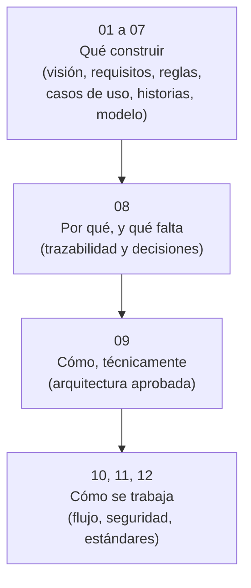

# Documentación funcional

## Estado

La documentación funcional (01 a 08) está lista para el alcance del MVP y la
arquitectura técnica (09) fue aprobada el 27 de agosto de 2026: juntas
autorizan el inicio de la programación. Quedan decisiones pendientes (`DP`)
explícitas en el documento 08, pero ninguna bloquea comenzar — dependen de la
muestra real del negocio y se resuelven en paralelo.

## Propósito

Documentar el problema, el alcance del MVP, el comportamiento esperado, las
decisiones técnicas adoptadas y cómo se trabaja para llevarlas a código.

Esta documentación es privada y no se publicará como código abierto ni como
producto. Se escribe como una **especificación autosuficiente**: cualquier
persona o asistente de programación debería poder implementar el sistema a
partir de estos documentos, sin depender de contexto no escrito aquí. Por
eso cada decisión indica su motivo, cada regla usa un identificador estable y
las decisiones pendientes (`DP`) están separadas de las ya adoptadas (`D`) para
que quien implemente sepa qué puede dar por cerrado y qué debe preguntar antes
de avanzar.

## Cómo están organizados

Los doce documentos se agrupan en cuatro bloques con un propósito distinto
cada uno:

- **01 a 07 — qué construir:** la especificación funcional. Se leen de
  corrido; cada uno se apoya en el anterior.
- **08 — por qué, y qué falta:** el documento bisagra. Conecta cada necesidad
  con sus `RF`/`CU`/`HU`, y lista todo lo decidido (`D`) con su motivo y lo
  pendiente (`DP`). Cuando otro documento dice «ver D-024», la respuesta
  completa está acá.
- **09 — cómo, técnicamente:** traduce el grupo anterior a stack, esquema de
  base de datos y operaciones críticas.
- **10, 11 y 12 — cómo se trabaja:** no describen el negocio ni sus precios,
  sino cómo debe comportarse cualquier conversación de tarea al programar
  (flujo entre conversaciones, seguridad, estándares de código). Los tres
  alimentan el mismo checklist de verificación.

## Documentos

1. [Visión y alcance](01-vision-y-alcance.md)
2. [Actores y permisos](02-actores-y-permisos.md)
3. [Requisitos](03-requisitos.md)
4. [Reglas de negocio](04-reglas-de-negocio.md)
5. [Casos de uso](05-casos-de-uso.md)
6. [Historias de usuario y criterios de aceptación](06-historias-y-aceptacion.md)
7. [Modelo conceptual](07-modelo-conceptual.md)
8. [Trazabilidad y decisiones pendientes](08-trazabilidad-y-decisiones.md)
9. [Propuesta de arquitectura técnica](09-propuesta-arquitectura-tecnica.md)
10. [Flujo de trabajo entre conversaciones](10-flujo-de-trabajo.md)
11. [Seguridad y privacidad](11-seguridad-y-privacidad.md)
12. [Estándares de código](12-estandares-de-codigo.md)

## Convenciones

- La documentación describe roles y procesos, sin identificar personas, relaciones personales ni dispositivos concretos.
- **MVP:** primera versión útil del sistema.
- **Usuario:** persona autenticada con rol de Administradora o Empleada.
- **Organización:** titular de uno o más negocios. Es el ámbito del catálogo y de las cuentas.
- **Negocio:** comercio concreto donde se venden los productos. Es el ámbito del precio y, en el futuro, de la existencia y las ventas. El MVP funciona con uno solo.
- **Producto:** agrupación comercial que sirve para buscar y navegar. No lleva precio.
- **Variante:** unidad vendible; lo que efectivamente se vende y se cotiza. Todo producto tiene al menos una, implícita cuando no hay diferencias reales. En el futuro llevará su código de barras y su stock.
- **Atributo normalizado:** característica con una lista cerrada de valores, como el color. Los atributos y sus valores son datos, no parte del sistema.
- **Precio vigente:** único precio de venta aplicable a una variante en un negocio en el momento de la consulta.
- Los identificadores `RF`, `RNF`, `RN`, `CU` e `HU` corresponden a requisitos funcionales, requisitos no funcionales, reglas de negocio, casos de uso e historias de usuario. `RN-F`, `D`, `DP` y `PT` corresponden a reglas previstas para etapas futuras, decisiones adoptadas, decisiones pendientes y propuestas técnicas.
